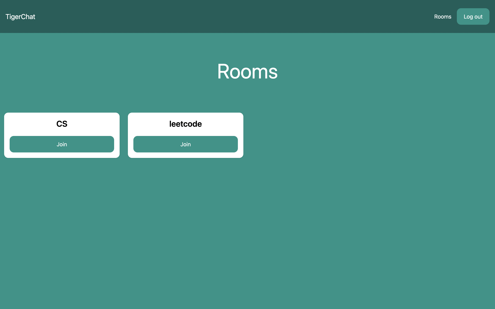

# ChatApp
## Python, Django

This project is a full-stack real-time messaging web app that I built. The app has several cool features, like rooms and authorization. The app is built across Web Sockets using Python and the Django framework.

To run this code, you will need to download the code files and make sure python is running. Enter the directory and then:
 ```
pip install -r requirements.txt
python manage.py runserver
 ```
The project will run on http://127.0.0.1:8000/


